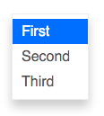

# Dropdown

Dropdown list.



```jsx
import DropdownBtn from 'patchkit-dropdown'

const onSelect = o => console.log('selected', o)
const onClose = o => console.log('close')

// simple string items:
const ITEMS = [
  'First',
  'Second',
  'Third'
]
<DropdownBtn className="btn highlighted" items={ITEMS} onSelect={onSelect} onClose={onClose}>Click to open</DropdownBtn>

// custom rendering:
class DropdownItem extends React.Component {
  render() {
    return <li>Item: {this.props.obj.value}</li>
  }
}
const ITEMS = [
  { Com: DropdownItem, value: 1 },
  { Com: DropdownItem, value: 2 },
  { Com: DropdownItem, value: 3 }
]
<DropdownBtn className="btn highlighted" items={ITEMS} onSelect={onSelect} onClose={onClose}>Click to open</DropdownBtn>

// onSelect for individual items:
const ITEMS = [
  { label: 'First',  value: 1, onSelect: o => console.log('selected first') },
  { label: 'Second', value: 2, onSelect: o => console.log('selected second') },
  { label: 'Third',  value: 3, onSelect: o => console.log('selected third') }
]
<DropdownBtn className="btn highlighted" items={ITEMS}>Click to open</DropdownBtn>
```

You can use the dropdown directly, without the button, if you want to:

```jsx
import { Dropdown } from 'patchkit-dropdown'

<Dropdown items={ITEMS} isOpen onSelect={onSelect} onClose={onClose} />
```

## Styles

Use the .less file:

```less
@import "node_modules/patchkit-dropdown/styles.less"
```